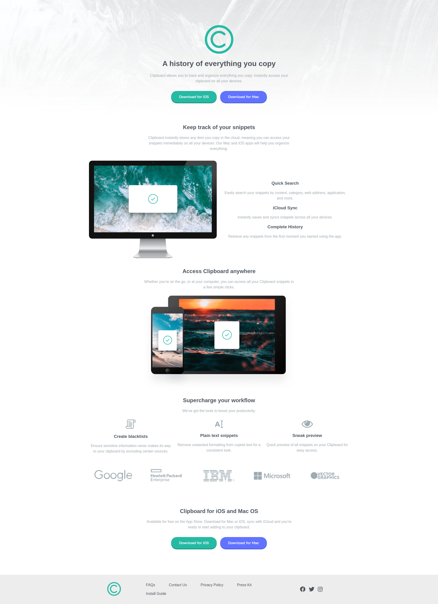

# Frontend Mentor - Clipboard Landing Page

Clipboard landing page design from the website Frontend Mentor.
https://www.frontendmentor.io/challenges/clipboard-landing-page-5cc9bccd6c4c91111378ecb9

As it is the first 'junior' challenges, I made it as professional as it could be shown. I used a lot of nested divs and some of those divs I used them again and again. What I learned form this challenge is to design it in a paper with a pen so it would be easier and faster to write the html code.

This is the preview I made:

Live: 
